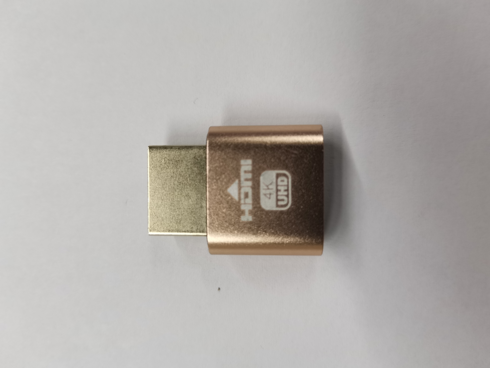

常见问题处理
=========================

地面站显示罗盘报错
-----------------------

导航控制板室内参数由于定位采用T265提供的定位数据，因此会将罗盘禁止掉，禁止掉后地面站会出现罗盘报错的信息，同时GPS也会被禁止掉，也会显红。
如果是导航控制板室外参数出现该报错，需考虑是否是周围环境干扰导致，如果一直出现，请参考Mission Planner地面站介绍中的校准部分内容进行校准。

无人车遥控器无法控制无人车移动
------------------------------

该问题可能是以下几个原因导致：

1.刚开机时，无人车无法控制，需要等待一段时间

2.无人车未切到manual模式，需要将SWC档杆打至最顶端，在地面站上确认无人车模式为manual模式

电脑端检测不到无人车Wifi或其他硬件模块异常
-------------------------------------------

无人车低电量时，电压不够，导致硬件电压不足，无法正常运行，将无人车充满电即可

NoMachine远程连接X86电脑失败
-------------------------------

首先确认，无人车X86板载计算机的HDMI口是否有插上“欺骗器"

如果是插上后依然连不上，需要确认无人车X86电脑是否连接上数传提供的Wifi以及ip是否能ping通

三维建图功能启动失败
-----------------------

根据报错信息查找问题原因，大部分情况下是因为设备未正确识别导致的，通过rs-sensor-control命令查看相机是否被板载计算机检测到

