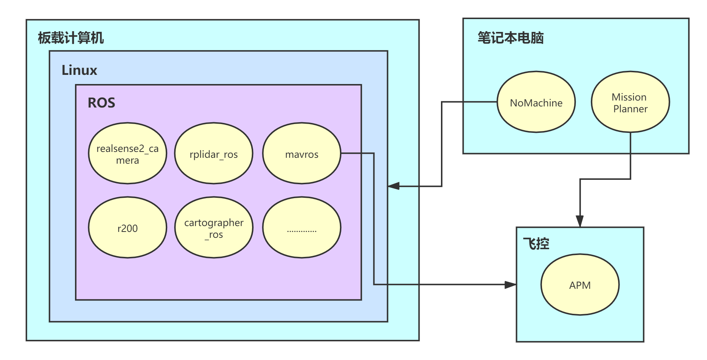

软件介绍
=========================

软件框架图
-------------------------

图中浅蓝色方框表示为硬件模块，含有板载计算机，导航控制板以及笔记本电脑。

黄色方框代表硬件内搭载的软件模块。

笔记本电脑用于远程控制无人车，需在Windows系统下安装好Mission Planner地面站软件以及Nomachine软件

.. tip::

    `Mission Planner下载地址 <https://ardupilot.org/planner/docs/mission-planner-installation.html>`_
    
    `Nomachine下载地址 <https://www.nomachine.com/>`_

在导航控制板中，我们已经预装好APM固件，并配置好相关参数。
在板载计算机中，我们预装好Linxu系统，ROS系统以及相关硬件ROS驱动功能包，包括realsnese2_camera、rplidar_ros等，
也有连接导航控制板的ROS功能包mavros以及无人车r200的相关功能包。

realsense2_camera
---------------------

realsense2_camera是ROS下的功能包，提供intel realsense系列视觉传感器的ROS驱动，启动相应的
ROS节点，就可以通过ROS话题的形式获取相机传感器的数据。

rplidar_ros
---------------

rplidar_ros是ROS下的功能包，提供激光雷达传感器的ROS驱动，启动相应的ROS节点，
就可以通过ROS话题的形式获取激光雷达传感器的数据。

mavros
--------------

mavros是ROS下的功能包，提供导航控制板的ROS驱动，启动相应的ROS节点，就可以与导航控制板建立起数据通信，在R200无人车中是通过串口将X86板载计算机
与导航控制板进行连接，该节点会将导航控制板的数据上发至X86板载计算机，并且提供X86板载计算机控制导航控制按的接口。

r200
----------------

r200为r200无人车的功能包总称，功能包分为r200_bringup（无人车驱动）,r200_function（无人车功能）,r200_simulation（无人车仿真）将传感器，导航控制按，功能等内容整合在该功能包内，让用户能够更快速地掌握以及上手无人车相关内容。

cartographer_ros
-------------------

cartographer_ros是由google推出的二维以及三维的实时定位与建图（SLAM）算法功能包。

NoMachine
------------

NoMachine在无人车已经装好，用户需要在远程控制无人车的电脑上安装，用于连接无人车上的X86板载计算机，实现远程控制

Mission Planner
------------------

导航控制板的地面站软件，用于监测无人车的状态以及查看相关数据等等内容

.. tip::
    Mission Planner地面站相关介绍，请关注 
    `Mission Plannerd地面站介绍 <https://car-wiki.readthedocs.io/en/latest/docs/bases/Mission%20Planner%E5%9C%B0%E9%9D%A2%E7%AB%99%E4%BB%8B%E7%BB%8D.html>`_
    相关内容

APM
-------

APM为导航控制板中安装的程序，完成无人车的运动控制，传感器数据采集融合，地面站数据交互等等内容。