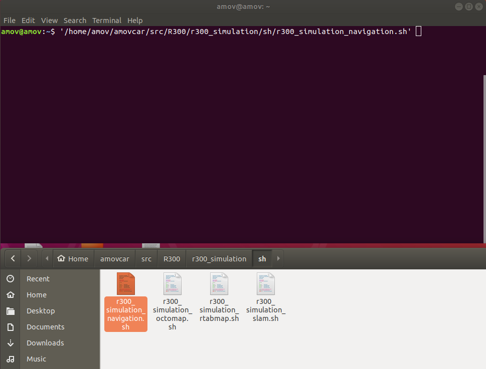
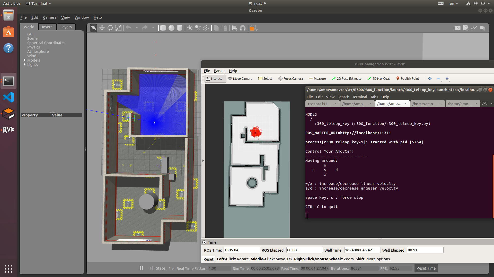
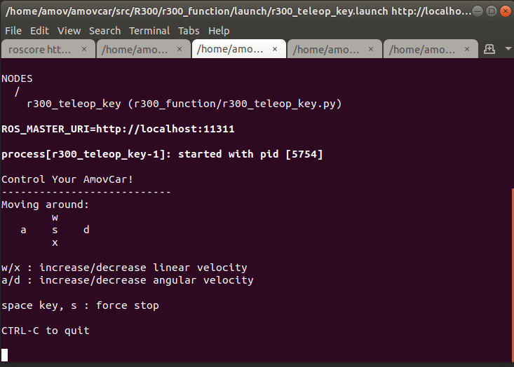
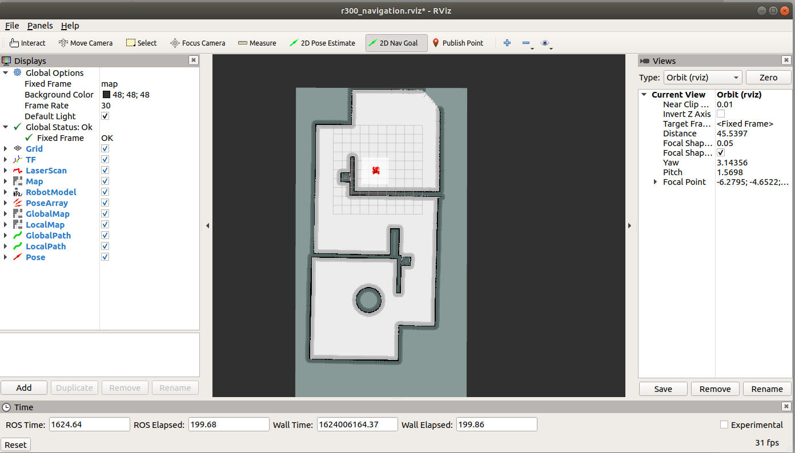
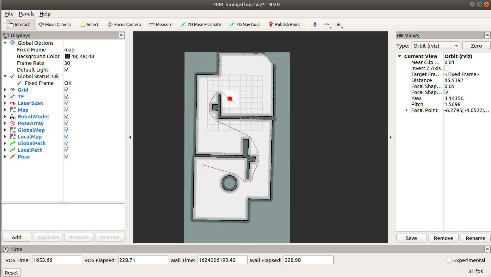
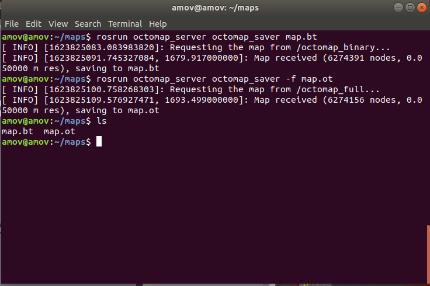
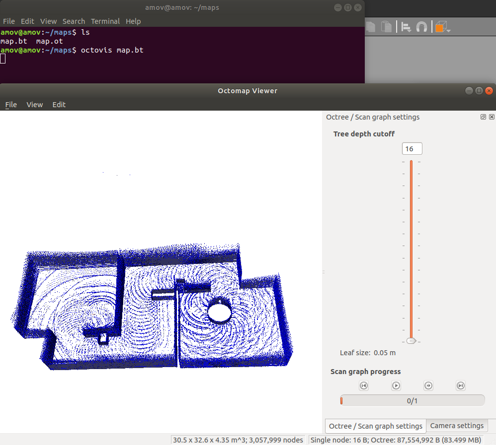
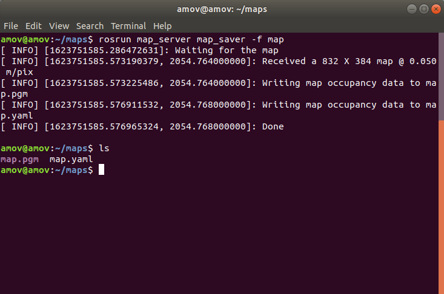
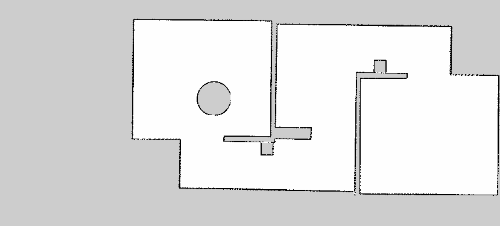

R300仿真
=========================

仿真系统介绍
--------------------

R300仿真系统基于ROS以及Gazebo仿真系统搭建，提供无人车车体模型，并提供二维激光雷达、三维激光雷达以及深度相机等传感器仿真，
目前配备有navigation导航功能，RtabMap三维建图功能，OctoMap三维建图功能，SLAM建图功能。

navigation导航功能
---------------------

启动的sh脚本为amovcar/src/R300/r300_simulation/sh/r300_simulation_navigation.sh，该sh文件包含以下部分：

1、ros主节点的启动

2、r300仿真启动，包含仿真环境，无人车模型以及传感器仿真，TF等内容

3、键盘控制节点，控制无人车移动

4、navigaiton导航功能

5、rviz可视化界面，该界面为针对navigation功能设置，显示规划航线，代价地图，定位粒子，激光雷达数据以及无人车模型等内容。

任意打开一个终端，将r300_simulation_navigation.sh文件拖入终端窗口内，便会出现启动该sh脚本的命令，按下回车启动即可。

正常启动如下图所示

检查弹出的终端窗口，检测每个终端中的节点是否均正常启动，确认节点运行正常后，在第三个键盘控制的终端内按下A或者D键，给无人车一个角速度（建议角速度控制在0.5以内）
待无人车定位粒子收敛后，一般情况下无人车旋转一周即可，在键盘控制终端内按下crtl + c关闭该节点。

在rviz中选择 2D Nav Goal插件，在地图内选择任意一个点，用鼠标左键点击并长按后选择方向后松开即可发送导航目标点，无人车自动导航前往该目标点。

操作成功后，效果如下图所示

RtabMap三维建图功能
---------------------

启动的sh脚本为amovcar/src/R300/r300_simulation/sh/r300_simulation_rtabmap.sh，该sh文件包含以下部分：

1、ros主节点的启动

2、r300仿真启动，包含仿真环境，无人车模型以及传感器仿真，TF等内容

3、键盘控制节点，控制无人车移动

4、rtabmap建图功能，该功能主要利用深度相机的视觉图像以及深度图像进行三维建图。

任意打开一个终端，将r300_simulation_rtabmap.sh文件拖入终端窗口内，便会出现启动该sh脚本的命令，按下回车启动即可。

检查弹出的终端窗口，检测每个终端中的节点是否均正常启动，确认节点运行正常后，在第三个键盘控制的终端内输入相应控制指令控制无人车移动进行三维建图。

.. image:: ../../images/R300/R300-sim_rtabmap_1.png

OctoMap三维建图功能
---------------------

启动的sh脚本为amovcar/src/R300/300_simulation/sh/r300_simulation_octomap.sh，该sh文件包含以下部分：

1、ros主节点的启动

2、r300仿真启动，包含仿真环境，无人车模型以及传感器仿真，TF等内容

3、键盘控制节点，控制无人车移动

4、octomap建图功能，主要使用三维激光雷达点云数据进行建图

5、rviz可视化界面，该界面为针对octomap功能设置，显示地图以及无人车模型等内容。

任意打开一个终端，将r300_simulation_octomap.sh文件拖入终端窗口内，便会出现启动该sh脚本的命令，按下回车启动即可。

检查弹出的终端窗口，检测每个终端中的节点是否均正常启动，确认节点运行正常后，在第三个键盘控制的终端内输入相应控制指令控制无人车移动进行三维建图。

.. image:: ../../images/R300/R300-sim_octomap_1.png

建图完毕后可输入以下指令保存地图：

``rosrun octomap_server octomap_saver map_name.bt # 压缩版``

``rosrun octomap_server octomap_saver -f map_name.ot # 完整版``

.. tip::
    查看三维地图的命令需在保存地图的文件夹路径下输入,且生成地图文件会耗费一定时间，示例中地图文件生成耗费时间大概在5秒左右

查看三维地图可输入以下指令：
``octovis map_name.bt(ot)``

.. tip::
    查看三维地图需要下载ovtovis，输入下面命令可下载

    ``sudo apt-get install octovis``

    # 查看三维地图的命令需在保存地图的文件夹路径下输入

SLAM二维建图功能
---------------------

启动的sh脚本为amovcar/src/R300/r300_simulation/sh/r300_simulation_slam.sh，该sh文件包含以下部分：

1、ros主节点的启动

2、r300仿真启动，包含仿真环境，无人车模型以及传感器仿真，TF等内容

3、键盘控制节点，控制无人车移动

4、二维建图功能，主要使用二维激光雷达数据进行建图

5、rviz可视化界面，该界面为针对SLAM二维建图功能设置，显示地图以及无人车模型等内容。

任意打开一个终端，将r300_simulation_slam.sh文件拖入终端窗口内，便会出现启动该sh脚本的命令，按下回车启动即可。

检查弹出的终端窗口，检测每个终端中的节点是否均正常启动。确认节点运行正常后，在第三个键盘控制的终端内输入相应控制指令控制无人车移动进行二维建图。

.. image:: ../../images/R300/R300-sim_slam_1.png

建图完毕后可输入以下指令保存地图：

``rosrun map_server map_saver -f map_name``

.. image:: ../../images/R300/R300-sim_slam_2.png

输入该命令后会在当前文件夹下生成.pgm和.yaml格式的文件，通过ls命令可查看保存的地图文件map.yaml和map.pgm

建好的仿真环境地图

