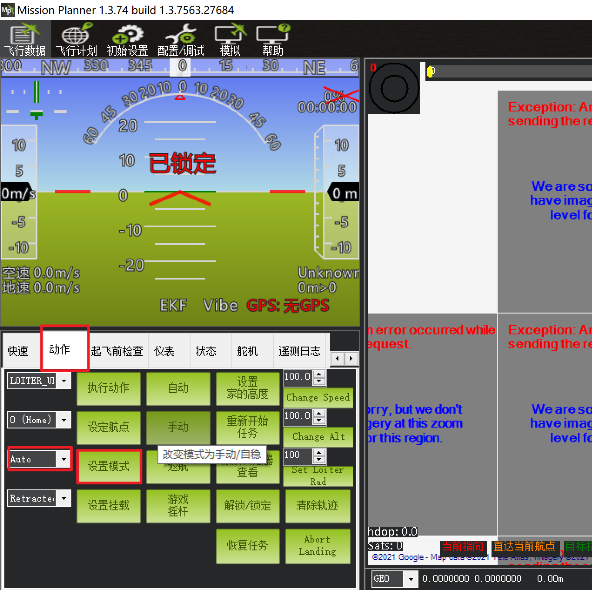

操作流程
==============

如何连接无人车？
-------------------

在使用无人车之前，需了解如何连接无人车，连接无人车需要用到两个软件，一是Mission Planner地面站用于连接导航控制板,
二是NoMahine用于连接板载计算机远程显示，在软件框架介绍板块有两个软件的下载地址，需下载安装到自己的电脑上。

连接步骤如下所示：

1.首先将Homer图数传天线、电源线以及网线插上。

.. warning::

    未插上天线、电源线以及网线前，禁止上电

.. image:: ../../images/R300/R300-Homer-connect.jpg

2.将Homer图数传基站端进行上电，并将网线插入到自己的笔记本电脑上，通过有线连接进入该局域网

.. warning::

    Homer图数传基站端供电电压为12V，需要使用我们提供的3S电池进行供电或使用其他供电模块（12V）。

3.启动无人车，在NoMachine中输入无人车板载计算机的ip，再输入用户名和密码（均为amov），便可连接上无人车的板载计算机

.. tip::

    无人车板载计算机IP: 192.168.10.14

    无人车飞控IP: 192.168.10.11

    Homer移动端IP: 192.168.10.10

    Homer基站端IP: 192.168.10.100

RTK定位
---------------

1.将RTK基站端装好天线，电源线以及串口转USB线

2.将RTK基站端上电，并将串口转USB线接入到笔记本电脑中

3.将HOMER图数传基站端上电并连接到笔记本电脑

4.将无人车开机，笔记本电脑连接上无人车并通过MP地面站连接导航控制板

5.在MP地面站选择 初始设置 -> 可选硬件 -> RTK/GPS Inject,选择连接RTK基站端的USB口

6.等待一段时间后无人车将进入RTK定位

遥控器控制
---------------

1.按下无人车的开机按钮后等待大约10S

2.将遥控器开机，并将SWB档杆打至中间位置切换无人车为遥控器控制模式

3.通过摇杆控制无人车前后左右进行移动

键盘控制
---------------

1.按下无人车的开机按钮

2.将遥控器开机

3.连接无人车的Wifi，用Mission Planner地面站以及NoMachine连接无人车

4.在NoMachine界面中找到无人车板载计算机桌面的sh脚本文件夹

5.在该文件夹内点击鼠标右键，选择Open in Terminal选项打开一个终端，输入以下命令启动键盘控制功能

``./r300_keyboard_control.sh``

6.在终端窗口内按下相应的按键即可控制无人车移动

|    W:  按下一次，无人车线速度增加一定的值
|    X:  按下一次，无人车线速度减小一定的值
|    A:  按下一次，无人车角速度增加一定的值
|    D:  按下一次，无人车角速度减小一定的值
|    S:  按下后，无人车线速度以及角速度归零

航点规划与VFH避障功能
-------------------------------------

1.按下无人车的开机按钮

2.将遥控器开机，并将SWB档杆打至中间位置切换无人车为遥控器控制模式，控制无人车移动到测试场地

.. tip::
    因无人车在导航控制板启动时的点认为是Home点，建议到达测试场地后重启无人车

3.连接无人车的Wifi，用Mission Planner地面站连接无人车

4.在地面站中点击左上角的飞行计划，进入到航点设置界面，鼠标左键点击地图上任意一个点，便可设置航点
左上角以及下方会显示航点相关属性以及设置，可根据情况适当修改，航点设置好以后，点击右侧的写入航点。

.. note::
    按以上步骤操作完成后，再启动板载计算机，可直接运行航点相关脚本文件，板载计算机连接导航控制板时，会采用之前设置的航点，新设置的航点，
    板载计算机无法获取，可以理解为每设置一次航点后，无人车都需要重启一次，新的航点才会生效。

5.打开板载计算机电源，并通过NoMachine连接无人车X86电脑，打开桌面上的sh脚本文件夹

6.在该文件夹内点击鼠标右键，选择Open in Terminal选项打开一个终端，输入以下命令启动航点规划以及VFH避障功能

``./r300_vfh.sh``

7.在Mission Planner地面站中选择 动作-> 模式（AUTO或GUIDED） -> 设置模式，即可将无人车设置为AUTO或GUIDED模式

.. tip::

    AUTO模式下无人车会按照航点规划移动

    GUIDED模式下无人车会按照航点规划移动并且带有VFH避障功能

二维建图
---------------

1.按下无人车的开机按钮

2.将遥控器开机

3.连接无人车的Wifi，启动NoMachine连接无人车的板载计算机

4.在NoMachine界面中找到无人车板载计算机桌面的sh脚本文件

5.在该文件夹内点击鼠标右键，选择Open in Terminal选项打开一个终端，输入以下命令启动二维建图功能

``./r300_cartographer_slam.sh``

6.正常情况下，各节点启动均正常，能看到rviz中显示的地图

7.通过遥控器控制无人车进行移动，建好区域的地图后，输入以下命令保存地图

``rosrun map_server map_saver -f map_name``

.. tip::
    命令中map_name为保存的地图相关文件名，会生成一个pgm和yaml格式文件

    文件会被保存在输入命令的终端所在文件夹路径下

三维建图
---------------

1.按下无人车的开机按钮

2.将遥控器开机

3.连接无人车的Wifi，启动NoMachine连接无人车

4.在NoMachine界面中找到无人车板载计算机桌面的sh脚本文件

5.在该文件夹内点击鼠标右键，选择Open in Terminal选项打开一个终端，输入以下命令启动三维建图功能

``./r300_rtabmap.sh``

6.通过遥控器控制无人车移动建立区域的三维地图

.. tip::
    如果节点启动异常，请使用rs-sensor-control命令查询是否出现T265以及D435i相机，未出现的情况下，说明设备未正常连接板载计算机，
    请尝试换个USB口或重启无人车

navigation
---------------

1.按下无人车的开机按钮

2.将遥控器开机

3.连接无人车的Wifi，启动NoMachine连接无人车

4.在NoMachine界面中找到无人车板载计算机桌面的sh脚本文件

5.在该文件夹内点击鼠标右键，选择Open in Terminal选项打开一个终端，输入以下命令启动navigation功能

``./r300_navigation_outdoor.sh``

.. tip::
    定位数据来源为飞控给出的定位数据，该定位数据全局坐标为GPS坐标系，本地坐标采用ENU坐标系，也就是定位数据的X轴指向东边，Y轴指向北边。

6.在rviz中选择 2D Nav Goal插件，在地图内选择任意一个点，用鼠标左键点击并长按后选择方向后松开即可发送导航目标点，无人车自动导航前往该目标点。

.. note::
    需将遥控器SWB档杆打至最上端切换为板载计算机控制模式，无人车才会按照板载计算机端给出的控制数据进行移动。

