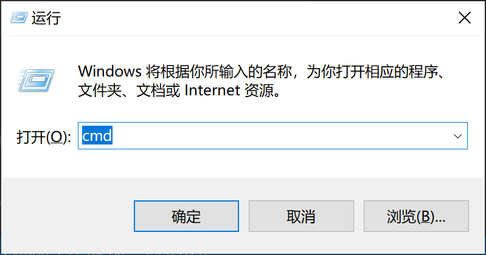
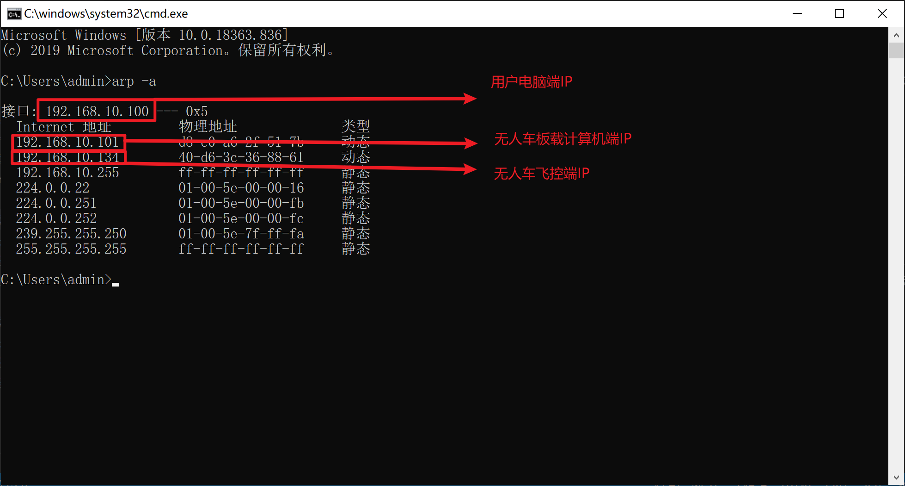

操作流程
==============

如何连接无人车？
-------------------

在使用无人车车之前，需了解如何连接无人车，连接无人车需要用到两个软件，一是Mission Planner地面站用于连接飞控,
二是NoMahine用于连接板载计算机远程显示，在软件框架介绍板块有两个软件的下载链接，需安装到自己的电脑上。

连接步骤如下所示：

1.首先连接上无人车的Wifi，成功连接后可通过按下Windows + R键打开运行窗口，在框内输入cmd按下回车。

.. tip::

    无人车的Wifi数传会提供一个局域网，Wifi名以及密码会在无人车的侧面标签上标注，

    用户在收到小车后，应将Wifi相关信息保存好，避免因长期使用后侧面标签脱落,导致信息丢失。

    标签内容如下图：

    .. image:: ../../images/R200/R200-wifi.png

    标注了Wifi名称以及密码。其中Wifi地址和端口号指地面站连接飞控时，需要输入的IP地址和端口号。

2.在出现的终端中输入arp -a可查看该局域网所有的IP地址，我们只需关注192.168.10.**网段的ip地址，一般情况下，该网段会出现三个IP地址
一是无人车飞控，二是无人车板载计算机，三是用户电脑端。

无人机飞控为固定IP，为无人车侧面标签的Wifi地址，图中为192.168.10.134

在Windows终端中“接口：”后的ip地址为用户客户端ip，图中为192.168.10.100

在通过arp -a 查询的所有ip中找到192.168.10.**网段剩余的ip（192.168.10.255除外）即为无人车板载计算机的ip，图中为192.168.10.101

3.在NoMachine中输入无人车板载计算机的ip，再输入用户名和密码（均为amov），便可连接上无人车的板载计算机

遥控器控制
---------------

1.按下无人车的开机按钮后等待大约10S

2.将遥控器开机，并将SWB档杆打至中间位置切换无人车为遥控器控制模式

3.通过摇杆控制无人车前后左右进行移动

键盘控制
---------------

1.按下无人车的开机按钮

2.将遥控器开机

3.连接无人车的Wifi，用Mission Planner地面站以及NoMachine连接无人车

4.在NoMachine界面中找到无人车板载计算机桌面的sh脚本文件夹

5.在该文件夹内点击鼠标右键，选择Open in Terminal选项打开一个终端，输入以下命令启动键盘控制功能

``./r300_keyboard_control.sh``

6.在终端窗口内按下相应的按键即可控制无人车移动

|    W:  按下一次，无人车线速度增加一定的值
|    X:  按下一次，无人车线速度减小一定的值
|    A:  按下一次，无人车角速度增加一定的值
|    D:  按下一次，无人车角速度减小一定的值
|    S:  按下后，无人车线速度以及角速度归零

航点规划与VFH避障功能
---------------

1.按下无人车的开机按钮

2.将遥控器开机，并将SWB档杆打至中间位置切换无人车为遥控器控制模式，控制无人车移动到测试场地

.. tip::
    因无人车在飞控启动时的点认为是Home点，建议到达测试场地后重启无人车

3.连接无人车的Wifi，用Mission Planner地面站连接无人车

4.在地面中点击左上角的飞行计划，进入到航点设置界面，鼠标左键点击地图上任意一个点，便可设置航点
左上角以及下方会显示航点相关属性以及设置，可根据情况适当修改，航点设置好以后，点击右侧的写入航点。

.. note::
    按以上步骤操作完成后，再启动板载计算机，可直接运行航点相关脚本文件，板载计算机连接飞控时，会采用之前设置的航点，新设置的航点，
    板载计算机无法获取，可以理解为每设置一次航点后，无人车都需要重启一次，新的航点才会生效。

5.打开板载计算机电源，并通过NoMachine连接无人车X86电脑，打开桌面上的sh脚本文件夹

6.在该文件夹内点击鼠标右键，选择Open in Terminal选项打开一个终端，输入以下命令启动航点规划以及VFH避障功能

``./r300_vfh.sh``

6.在Mission Planner地面站中选择 动作-> 模式（AUTO或GUIDED） -> 设置模式，即可将无人车设置为AUTO或GUIDED模式

.. image:: ../../images/R300/R300-setmode.png

.. tip::

    AUTO模式下无人车会按照航点规划移动

    GUIDED模式下无人车会按照航点规划移动并且带有VFH避障功能

二维建图
---------------

1.按下无人车的开机按钮

2.将遥控器开机

3.连接无人车的Wifi，启动NoMachine连接无人车的板载计算机

4.在NoMachine界面中找到无人车板载计算机桌面的sh脚本文件

5.在该文件夹内点击鼠标右键，选择Open in Terminal选项打开一个终端，输入以下命令启动二维建图功能

``./r300_cartographer_slam.sh``

6.正常情况下，各节点启动均正常，能看到rviz中显示的地图

7.通过遥控器控制无人车进行移动，建好区域的地图后，输入以下命令保存地图

``rosrun map_server map_saver -f map_name``

.. tip::
    命令中map_name为保存的地图相关文件名，会生成一个pgm和yaml格式文件

    文件会被保存在输入命令的终端所在文件夹路径下

三维建图
---------------

1.按下无人车的开机按钮

2.将遥控器开机

3.连接无人车的Wifi，启动NoMachine连接无人车

4.在NoMachine界面中找到无人车板载计算机桌面的sh脚本文件

5.在该文件夹内点击鼠标右键，选择Open in Terminal选项打开一个终端，输入以下命令启动三维建图功能

``./r300_rtabmap.sh``

6.通过遥控器控制无人车移动建立区域的三维地图

.. tip::
    如果节点启动异常，请使用rs-sensor-control命令查询是否出现T265以及D435i相机，未出现的情况下，说明设备未正常连接板载计算机，
    请尝试换个USB口活重启无人车

