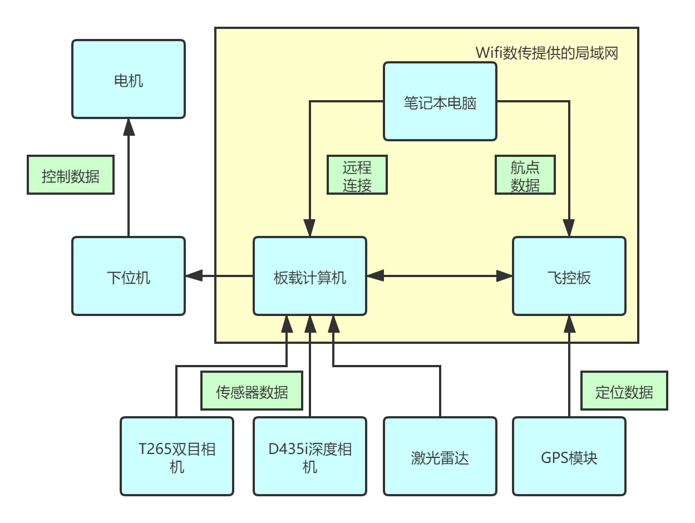

硬件框架介绍
=========================

硬件框架图
-------------

上图为R300无人车的硬件框架图，描述了各个硬件模块之间的连接状况以及数据传递情况。

其中，黄色框表示
**Wifi数传提供的局域网**
，可以看到，该局域网中，无人车的板载计算机以及导航控制板板都接入了该局域网，
其中导航控制板板是通过
**TELEM1**
口接入该局域网，板载计算机是通过无线连接数传的Wifi接入该局域网。
用户的笔记本电脑在使用时也应接入无人车Wifi数传的局域网中。

T265，D435i,激光雷达传感器模块将通过USB接口接入到板载计算机中。其中导航控制板板与板载计算机的数据交互也是通过USB线连接。

.. tip::
    需要注意，激光雷达与导航控制板会存在串口识别混淆的问题，我们已设置了串口硬链接解决该问题，但导航控制板和激光雷达的USB接口不可移动

    可重新插拔，但不可移动位置。

GPS模块通过
**GPS MODULE**
口接入导航控制板板

下位机通过CAN转USB连接线接入到板载计算机，获取由板载计算机传递过来的控制数据

板载计算机整合导航控制板相关数据，并接收导航控制板传递的控制数据下发给下位机，下位机将
控制数据转化为电机的控制数据，控制无人车轮胎转动，从而实现无人车的运动控制。