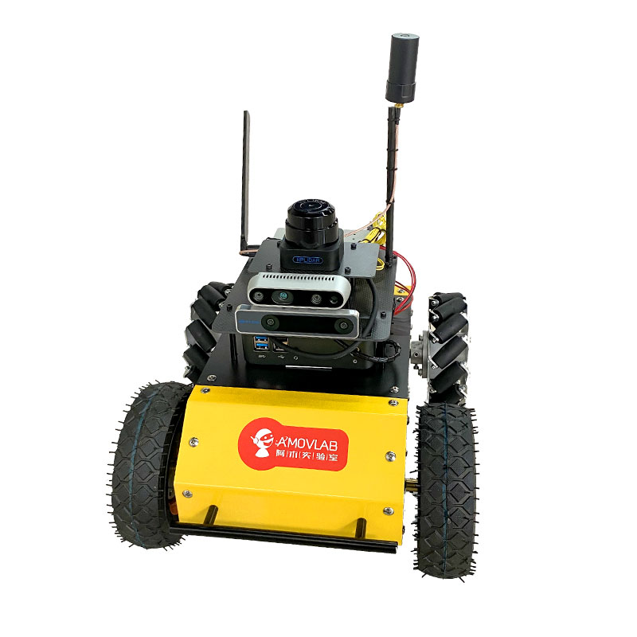
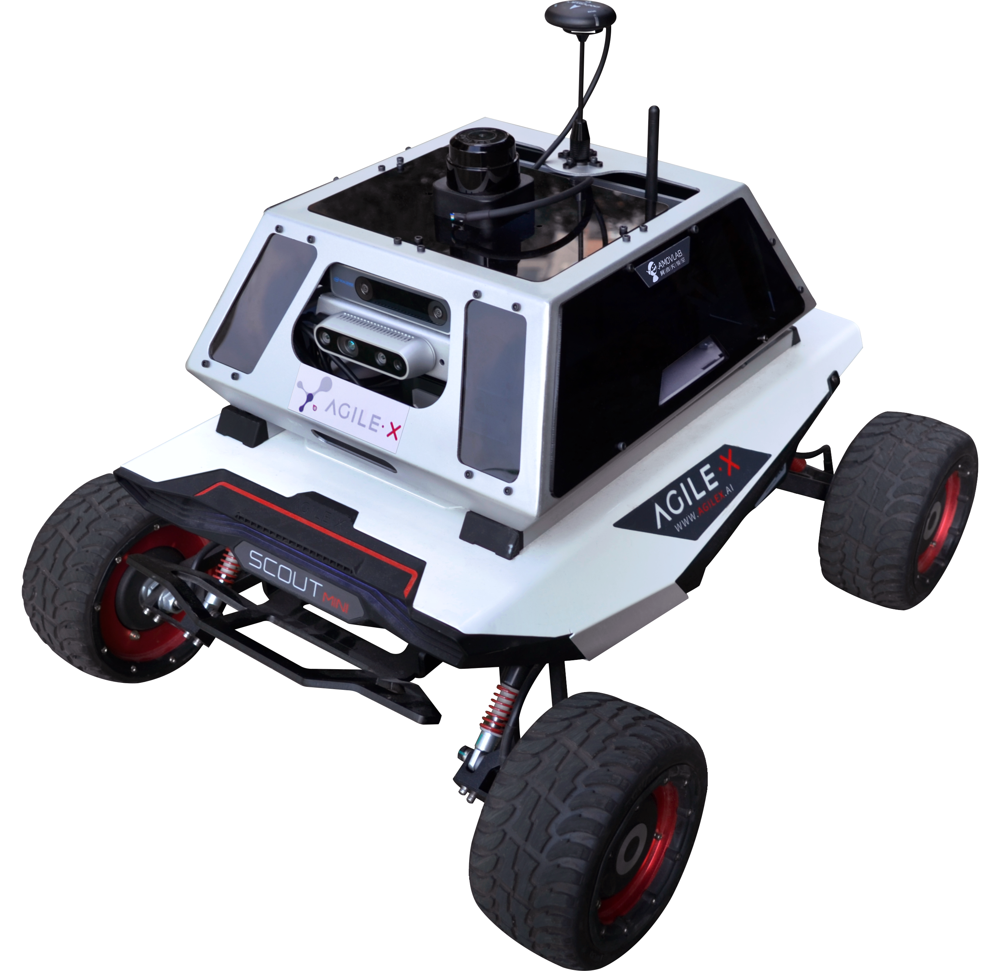

无人车产品介绍
=========================

R200
-------------

R200无人车车体属于中小型，兼容室内以及室外环境，车体主要包含车身，车轮，保险杠，电池等硬件，具备以下优点：

1.前后均配备有保险杠，有一定的防碰撞能力，能较好地保护车身及其他硬件，减少小车碰撞时的损坏。

2.车身大部分硬件采用金属材质，结实耐用。

3.车轮采用四轮驱动，动力更加充足，并且后轮采用麦克纳姆轮，转弯更加灵活，并且可以原地旋转。

4.小车拥有悬挂系统，能保证小车更加平稳地运行，保证各种传感器数据更加精确，稳定。

R300
----------

R300无人车车体属于中大型，越野性能优秀，偏向于室外环境，车体主要包含车身，车轮，保险杠，电池，车灯等硬件，具备以下优点：

1.前端配备有保险杠，有一定的防碰撞能力，能较好地保护车身及其他硬件，减少小车碰撞时的损坏。

2.车身大部分硬件采用金属材质，结实耐用。

3.车轮采用四轮驱动，动力更加充足，最高速度可达10km/h,并且可以原地旋转。

4.小车拥有悬挂系统，能保证小车更加平稳地运行，保证各种传感器数据更加精确，稳定。

5.24V15AH锂电池动力系统，续航里程可达10KM

6.可载重10KG以下物体

