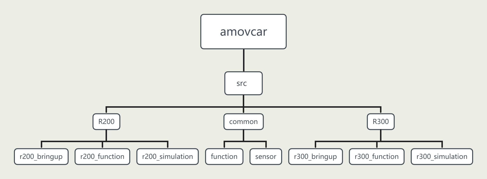

amovcar文件结构
=========================

amovcar文件结构图
-------------

amovcar文件结构描述
----------

.. tip::

    内容讲解中仅包含amovcar文件夹内重要的组成部分，存在未提及的文件。

amovcar
^^^^^^^^^^^
amovcar文件夹为ROS下的工作空间文件夹，包含无人车几乎所有的源代码文件，无人车功能包均放置在src文件夹下。

common
^^^^^^^^^^^
common文件夹内含有R200以及R300两款无人车通用的一些功能包，包含一些功能模块以及二维激光雷达、三维激光雷达、相机等传感器驱动ROS功能包。

R200
^^^^^^^^^^^

R200文件夹内含有r200_bringup、r200_function、r200_simulation三个功能包。

r200_bringup为R200小车底盘的驱动功能包，R200下位机控制板为飞控，通过mavros连接飞控与板载计算机，r200_bringup在mavros上做了一层封装。
    
r200_function文件内含有R200无人车所有功能的源代码，包含自启动服务、配置文件、launch文件、sh脚本文件以及源代码等内容。

r200_simulation文件内含有R200无人车仿真的源代码，包含模型、gazebo环境、launch文件、配置文件等内容。

R300
^^^^^^^^^^^

R300文件夹内含有r300_bringup、r300_function、r300_simulation三个功能包。

r300_bringup为R300小车底盘的驱动功能包。
    
r300_function文件内含有R300无人车所有功能的源代码，包含自启动服务、配置文件、launch文件、sh脚本文件以及源代码等内容。

r300_simulation文件内含有R300无人车仿真的源代码，包含模型、gazebo环境、launch文件、配置文件等内容。

