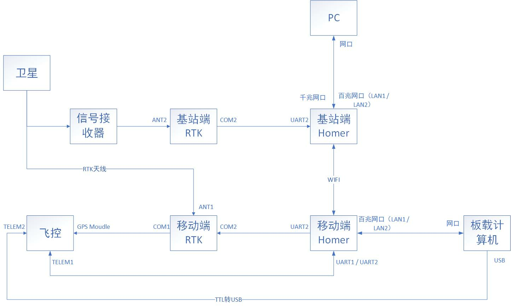
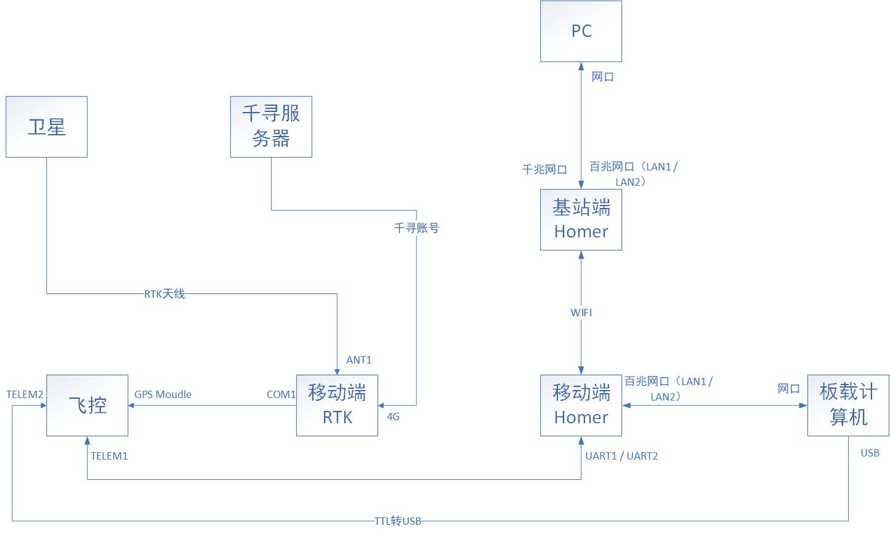

无人车通信链路介绍
=============================

R300无人车分为两个版本，一个为基站版，一个为4G版。二者的通信链路如下图所示

R300基站版通信链路图
------------------------------

流程介绍<TODO>

R300 4G版通信链路图
----------------------------------

流程介绍<TODO>

