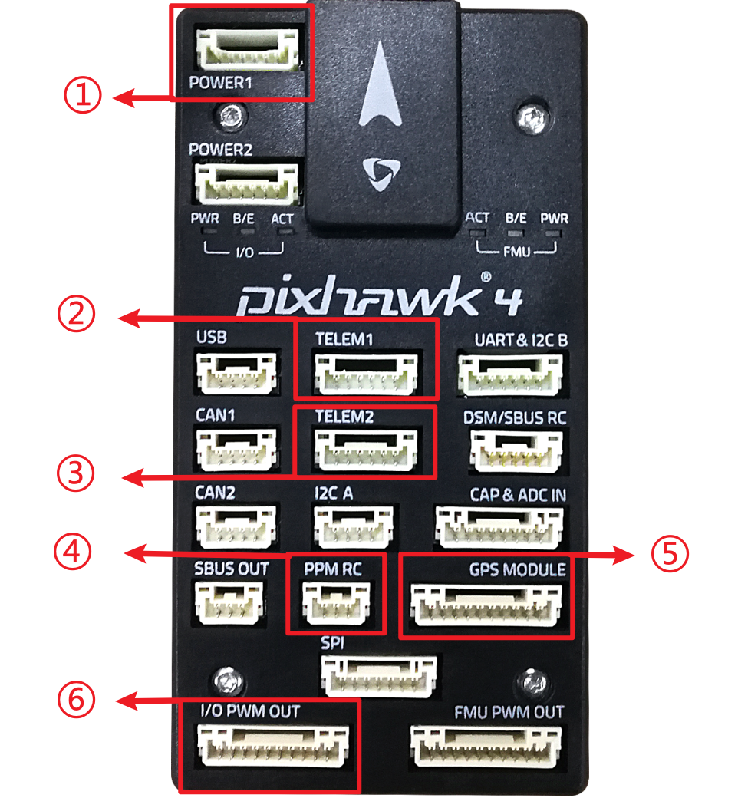
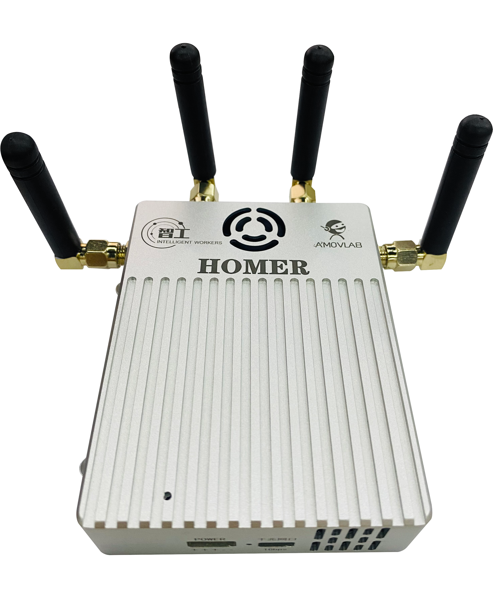
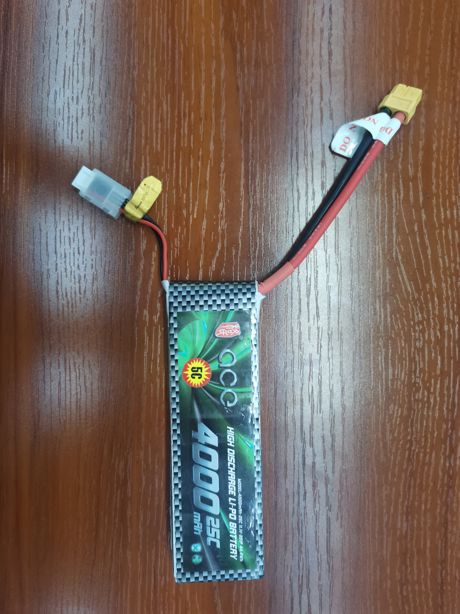

硬件模块介绍
=========================

飞控
-------------

飞控全称飞行控制器，配合无人机的其他系统以及其他元器件共同来控制无人机飞行
，飞控常与IMU（惯性测量单元）、气压计、磁罗盘等元器件共同组成飞行控制系统。

图中展示了无人车使用的飞行控制器（Pixhawk4），在这里对无人车常使用的接口做一个介绍：

（1） 
**POWER1：**
飞控的电源接口，由小车底盘电源通过降压模块给到飞控，供电电压为5V。

（2） 
**TELEM1：**
Wifi数传的数据接口，使飞控能够接入Wifi数传提供的局域网中。

（3） 
**TELEM2：**
连接板载计算机的接口，飞控通过TELEM2与板载计算机建立通信连接，板载计算机的控制数据
也通过这个接口发送到飞控中。

（4） 
**PPM RC：**
遥控器接收器信号接口，该接口会接收来自遥控器的控制信号。

（5） 
**GPS MODULE：**
GPS模块的接口，给GPS模块进行供电以及接收GPS模块传递的数据。

（6） 
**I/O PWM OUT：**
电机控制的PWM输出口，输出控制数据控制四个电机。

----------

板载计算机
-------------

.. image:: ../../images/bases/X86.png

板载计算机上预装了Linux操作系统以及ROS系统，并搭载有无人车的ROS功能包amovcar,板载计算机连接飞控，激光雷达，视觉传感器等硬件模块，
并通过无线连接的方式接入Wifi数传的局域网中。

----------

T265双目相机
-------------

.. image:: ../../images/bases/T265.png

英特尔® 实感™ 追踪摄像头 T265 包含两个鱼眼镜头传感器、一个 IMU 和一个英特尔® Movidius™ Myriad™ 2 VPU。所有的 V‑SLAM 算法都直接在 VPU 上运行，能够实现非常低的延迟和非常高效的功耗。
通过视觉与IMU以及V-SLAM算法的结合，T265双目相机能为无人车提供定位数据。

----------

D435i深度相机
-------------

.. image:: ../../images/bases/D435i.png

英特尔® 实感™ D435i在尖端立体深度摄像头中放置了一个IMU。D435i在小巧外形中采用英特尔模块和视觉处理器，是一个功能强大的一体产品，可与可定制软件配合使用，是一款能够了解自身运动的深度摄像头。

----------

Wifi数传
-------------

.. image:: ../../images/bases/Wifi.png

Wifi数传模块建立起一个局域网，无人车上的飞控，板载计算机以及用户的电脑进入到局域网中，方便用户远程访问无人车的飞控和板载计算机，实现远程控制以及数据监听。

----------

Homer图数传
-------------

Homer图数传与WIFI数传属于冲突的模块，一般情况下，无人车仅搭载两者任一模块即可，两个模块功能一致，都是为无人车搭建起一个局域网。Homer图数传模块一般情况下
会有两个，一个放在在无人车上，称为移动端，一个与用户的笔记本电脑连接，称为基站端。Homer图数传的传输距离以及性能远远强于WIFI数传。

---------

GPS模块
-------------

.. image:: ../../images/bases/GPS.jpg

GPS模块集成GPS传感器、罗盘、安全开关、蜂鸣器以及LED灯模块，为无人车提供定位数据。

----------

RTK模块
-------------

.. image:: ../../images/bases/RTK.png

RTK模块与GPS模块属于冲突的模块，RTK指Real Time Kinematic，也就是实时动态测量技术，也就是差分GPS，RTK分为基站端和移动端，移动端搭载在无人车上，基站端放置在地面上后需静止不动。
基站端将纠偏数据发送给移动端，无人车便从GPS定位切换为RTK定位，定位精度由米级定位提高到厘米级定位。

---------

遥控器接收器
-------------

.. image:: ../../images/bases/FS-iA6B.png

接收来自遥控器的控制数据，并传递给飞控，实现遥控器控制无人车运动。

3S电池
-------------

3S电池用于给Homer图数传基站端供电，直接插入Homer图数传电源口即可，3S电池满电电压12.6V，零电电压11.1V。

.. warning::

    3S电池过充过放容易导致电池损坏，在电压低于11.5V时建议停止继续使用，待电池冷却至常温后充电，充满电后也不要立即使用，待电池冷却至常温后使用。