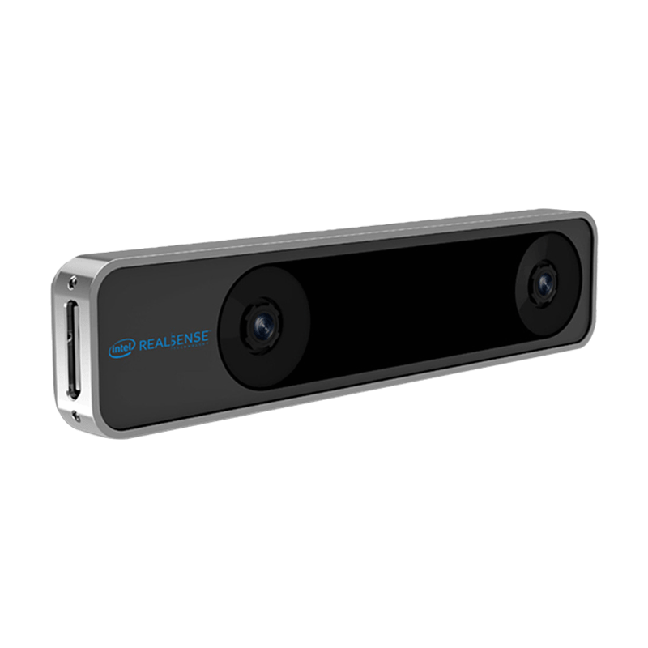
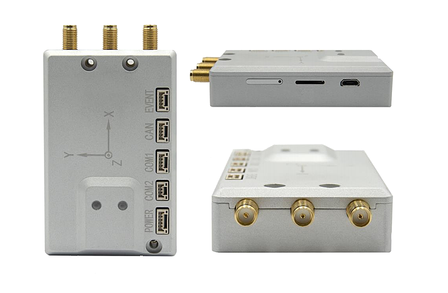

硬件模块介绍
=========================

飞控
-------------

.. image:: ../../images/bases/Pixhawk4.png

飞控全称飞行控制器，配合无人机的其他系统以及其他元器件共同来控制无人机飞行
，飞控常与IMU（惯性测量单元）、气压计、磁罗盘等元器件共同组成飞行控制系统。

图中展示了无人车使用的飞行控制器（Pixhawk4），在这里对无人车常使用的接口做一个介绍：

（1） 
**POWER1：**
飞控的电源接口，由小车底盘电源通过降压模块给到飞控，供电电压为5V。

（2） 
**TELEM1：**
Wifi数传的数据接口，使飞控能够接入Wifi数传提供的局域网中。

（3） 
**TELEM2：**
连接板载计算机的接口，飞控通过TELEM2与板载计算机建立通信连接，板载计算机的控制数据
也通过这个接口发送到飞控中。

（4） 
**PPM RC：**
遥控器接收器信号接口，该接口会接收来自遥控器的控制信号。

（5） 
**GPS MODULE：**
GPS模块的接口，给GPS模块进行供电以及接收GPS模块传递的数据。

（6） 
**I/O PWM OUT：**
电机控制的PWM输出口，输出控制数据控制四个电机。

板载计算机
-------------

.. image:: ../../images/bases/X86.png

板载计算机上预装了Linux操作系统以及ROS系统，并搭载有无人车的ROS功能包amovcar,板载计算机连接飞控，激光雷达，视觉传感器等硬件模块，
并通过有线连接的方式接入由Homer图数传组成的局域网中。

T265双目相机
-------------

英特尔® 实感™ 追踪摄像头 T265 包含两个鱼眼镜头传感器、一个 IMU 和一个英特尔® Movidius™ Myriad™ 2 VPU。所有的 V‑SLAM 算法都直接在 VPU 上运行，能够实现非常低的延迟和非常高效的功耗。
通过视觉与IMU以及V-SLAM算法的结合，T265双目相机能为无人车提供定位数据。

激光雷达
-----------

（TODO）

D435i深度相机
-------------

.. image:: ../../images/bases/D435i.png

英特尔® 实感™ D435i在尖端立体深度摄像头中放置了一个IMU。D435i在小巧外形中采用英特尔模块和视觉处理器，是一个功能强大的一体产品，可与可定制软件配合使用，是一款能够了解自身运动的深度摄像头。

Homer图数传
-------------

.. image:: ../../images/bases/Wifi.png

Homer图数传模块建立起一个局域网，将无人车上的板载计算机、飞控、RTK等车载硬件以及用户的电脑接入到局域网中。方便用户远程访问无人车的飞控和板载计算机，进而实现远程控制以及数据监听。

其中：

放置在车上的Homer称为 **移动端Homer**

与用户PC连接的Homer称为 **基站端Homer**

RTK模块
-------------

RTK(Real Time Kinematic)，即实时动态测量技术，又称差分GPS。该模块用于在室外定位无人车，其定位精度为厘米级。

其中：

放置在车上的RTK称为 **移动端RTK**。

与地面端Homer连接的称为 **基站端Homer**。

显示器
---------
TODO

3S电池
-------------

.. image:: ../../images/bases/battery.jpg

3S电池用于给 **基站端Homer** 和 **基站端RTK** 供电。3S电池满电电压12.6V。

.. warning::

    3S电池过充过放容易导致电池损坏，在电压低于 **10.8V** 时建议停止继续使用，待电池冷却至常温后充电，充满电后也不要立即使用，待电池冷却至常温后使用。