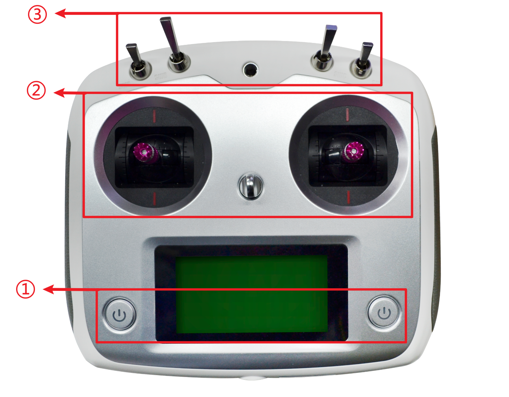

遥控器介绍
=========================

遥控器说明
-------------

（1） 开关机按钮：两个按钮同时按下将开启或关闭遥控器，开机时，遥控器上部分的档杆（四个SW*档杆）需全部打至顶端，
关机时，遥控器需与遥控器接收器断开连接（断开遥控器或接收器的电源）。

（2） 摇杆：左侧摇杆上下移动控制无人车前进后退，右侧摇杆左右移动控制无人车左右移动。

（3） 档杆：r200无人车中从左往右数第三根档杆（SWC）控制无人车的模式，一共有三档，打至最顶端将无人车切换为manual模式，
此时无人车受遥控器控制，打至中间为AUTO模式，此时无人车受飞控控制，打至底端为GUIDED模式，此时无人车受板载计算机控制。r300
无人车中从左往右数第二根档杆(SWB)控制无人车的模式，一共有两档，打至中间位置无人车受遥控器控制，打至最顶端受板载计算机控制。
SWC挡杆控制无人车灯光模式，最上端为呼吸灯模式，中间为常亮模式，最下端为常闭模式。SWD挡杆控制无人车切换高速和低速模式。
